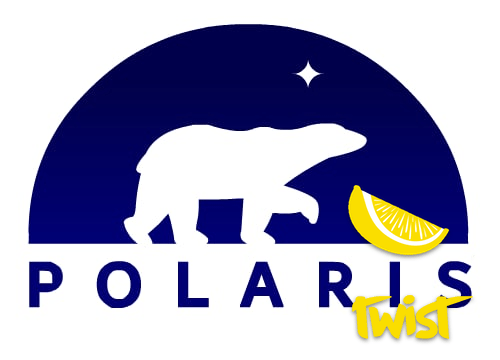

<p align="center">
  
  <br><br>
  
  
</p>

**Polaris Twist** 🍋 is a refreshing stack-based, concatenative, interpreted programming language with strings as its only data type. It's a revision of the original [Polaris](https://github.com/Lartu/polaris/tree/master),
much faster and with [Foreign Function Interface](https://en.wikipedia.org/wiki/Foreign_function_interface)
support.
It has been designed to be **small** in size and **minimal** in language features.
It has been written in C++98, so it can probably be compiled with any C++ compiler out there.

```c++
/* This is a little Polaris Twist quine */

("(" @f ") >f f%" fprint) >f f%
```

## Building Polaris Twist
To build Polaris Twist, clone this repository and run `make`. You can install it using `make install`. You can uninstall it with `make uninstall`.

## Documentation
I owe you the documentation. Sorry! Soon!

## License
The Polaris Twist interpreter is distributed under the Apache 2.0 License. Copyright (c) 2020-2024, Lartu ([www.lartu.net](https://www.lartu.net)).
